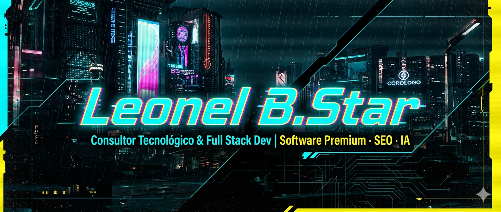

<!-- ╔═══════════════════════════════════════════════════════════════╗
     ║  PERFIL GITHUB · Leonel B.Star · estética cyberpunk neón       ║
     ║  Coloca tu banner en ./assets/banner.png (o cambia la ruta)    ║
     ╚═══════════════════════════════════════════════════════════════╝ -->

<div align="center">

<!-- BANNER -->


<br/><br/>

<!-- TÍTULO ANIMADO -->
<a href="https://github.com/barckstar">
  
</a>

<br/>

<!-- SUBTÍTULO -->
<h3>
  
  
  
  
</h3>

<!-- CONTADOR DE VISITAS -->


</div>

---

<div align="center">

### `> whoami`

</div>

```ts
const leonel = {
  alias:    "B.Star",
  rol:      "Consultor Tecnológico & Full Stack Developer",
  base:     "Costa Rica 🇨🇷",
  enfoque:  ["Software Premium", "SEO", "Inteligencia Artificial"],
  filosofia:"Construyo productos que se sienten vivos.",
};
```

🇪🇸 **Desarrollo software full-stack a la medida**, con foco en experiencias premium, posicionamiento (SEO) e integración de IA. Actualmente construyendo el e-commerce + plataforma de **CoopeHemp R.L.** (Medusa.js + React 19).

🇬🇧 **Full-stack developer & tech consultant** building premium, SEO-driven, AI-powered products. Currently shipping the **CoopeHemp R.L.** commerce platform (Medusa.js + React 19).

---

<div align="center">

### `> stack`


</div>

---

<div align="center">

### `> connect`

<a href="https://www.linkedin.com/in/leonelbstar">
  
</a>
<a href="https://www.youtube.com/@leonelbstar">
  
</a>
<a href="https://www.tiktok.com/@leonelbstar">
  
</a>
<a href="https://www.facebook.com/leonelbstar/">
  
</a>
<a href="https://www.instagram.com/leonelbstar/">
  
</a>

</div>

---

<div align="center">

### `> stats`


<br/>


</div>

---

<div align="center">

<sub>⚡ <i>Software Premium · SEO · IA</i> — <code>@leonelbstar</code> ⚡</sub>

</div>
